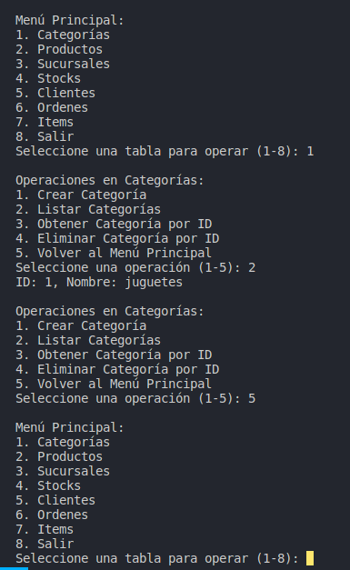

_Formación en bases de datos_
fundamentos de SQLite, postgresql.
ORM SQLAlquemy - Tortoise ORM

##Proyecto:
crear un CRUD por terminal a una base de datos mapeada a Tortoise.

Se utiliza la plataforma draw.io para los diagramas ER